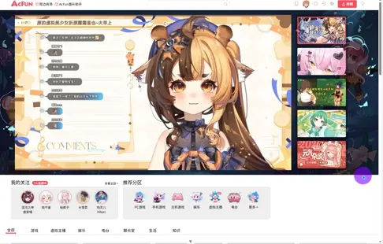
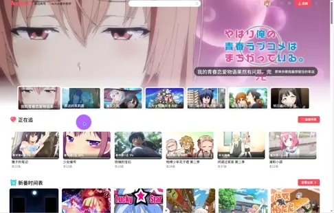
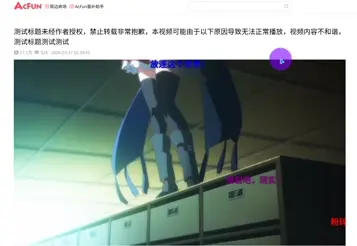

# acfun-imitate

综合视频分享平台，包括视频播放、直播板块、番剧板块等核心内容板块。

## 技术栈

Node.js | TypeScript | Vue3 | Vue-Router | Element Plus

## 界面预览

### 首页


**titlebar**


**首页滚动**


### 直播页



### 番剧页



### 视频播放与弹幕发送



### 更多内容开发中……

## 运行

### Setup

``` bash
pnpm install
```

### Run

``` bash
pnpm run dev
```

### Build

``` bash
vite build
```